# Azure Application Gateway

## Overview

This project demonstrates the deployment and configuration of an Azure Application Gateway to distribute HTTP traffic across two Linux virtual machines running Nginx. The project covers subnet creation, frontend configuration, backend pools, routing rules, validation, deployment and end-to-end load balancing verification.

---

## Architecture

```
                 Internet
                      │
                      ▼
        Azure Application Gateway
                      │
          ┌───────────┴───────────┐
          │                       │
          ▼                       ▼
 Linux Virtual Machine 1   Linux Virtual Machine 2
        (Nginx)                  (Nginx)
```

---

# Screenshots

### Create Application Gateway Subnet

Shows the dedicated subnet created for the Azure Application Gateway.

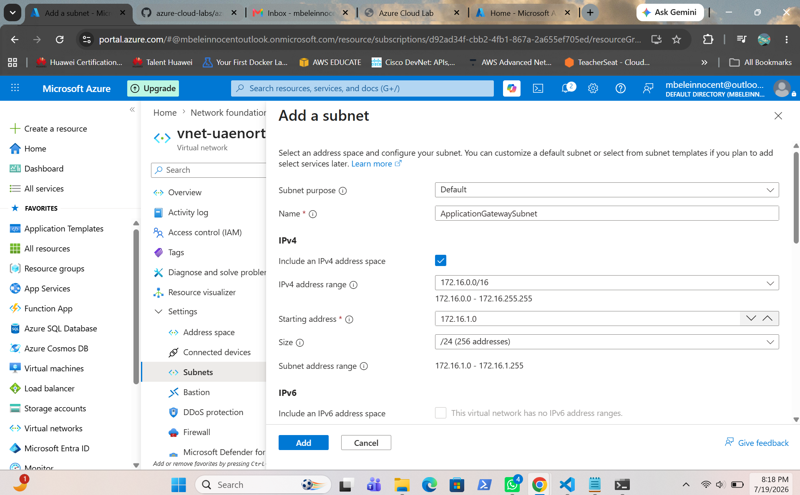

---

### Subnet Created

Shows the successfully created Application Gateway subnet.

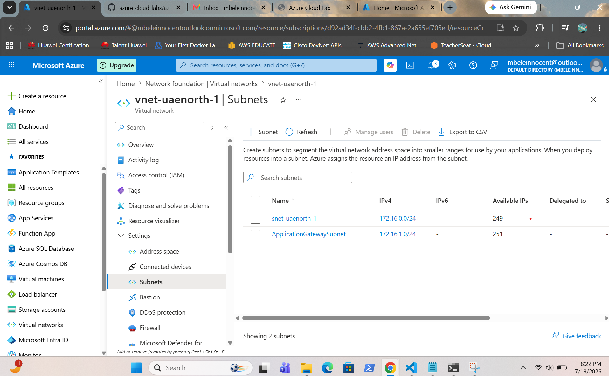

---

### Configure Basic Settings

Shows the basic configuration of the Azure Application Gateway.

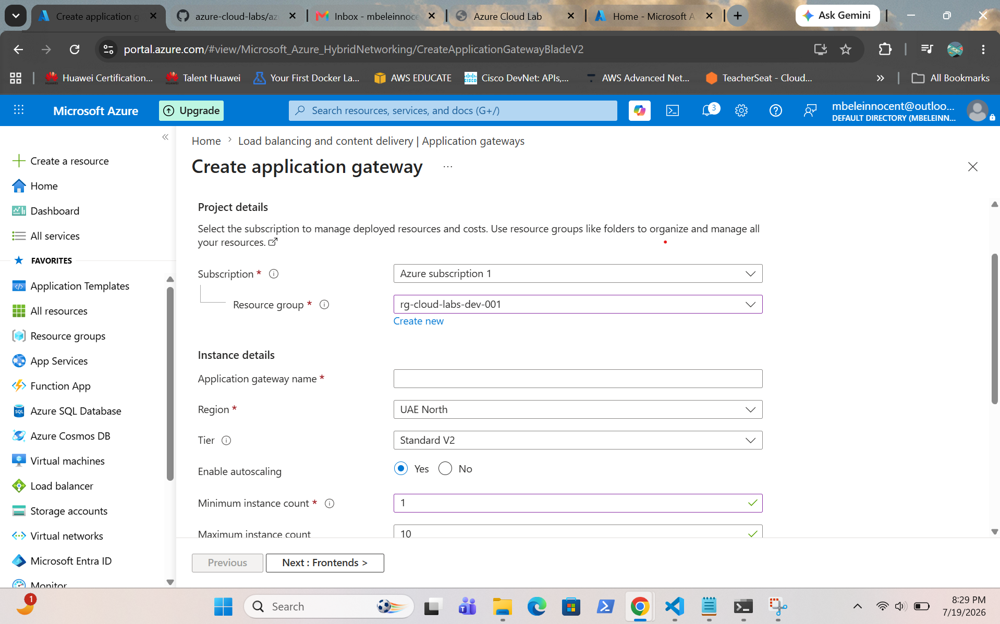

---

### Configure Frontend Public IP

Shows the frontend public IP configuration.

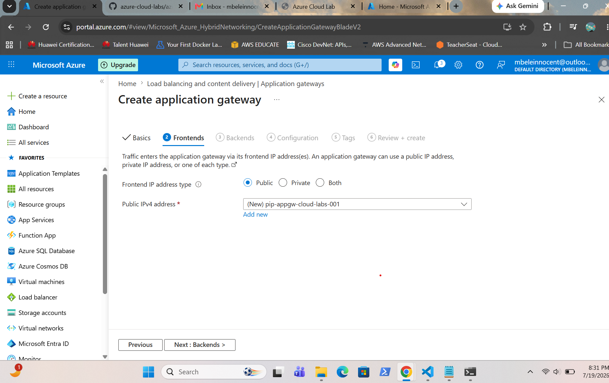

---

### Configure Backend Pool

Shows both Linux virtual machines added to the backend pool.

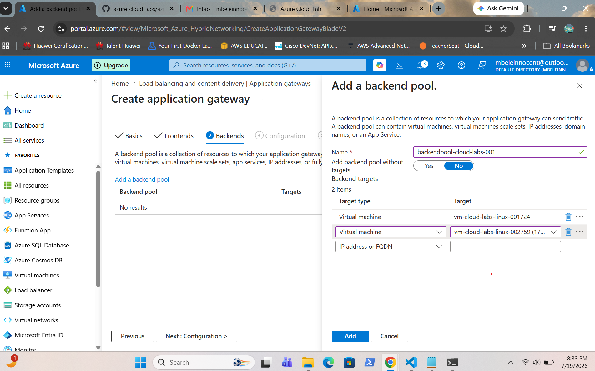

---

### Configure Routing

Shows the routing configuration.

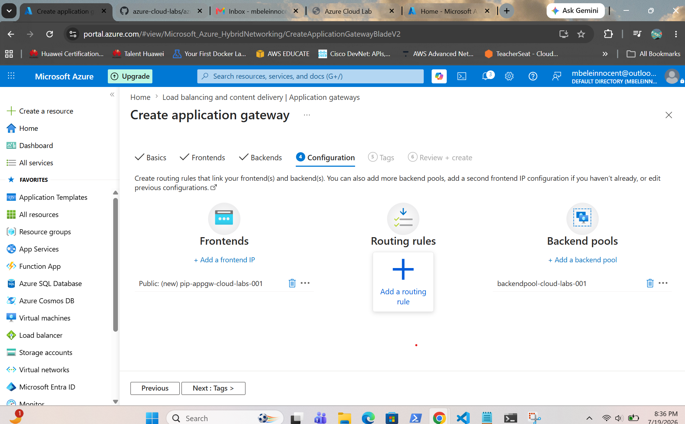

---

### Configure HTTP Listener

Shows the HTTP listener configuration.

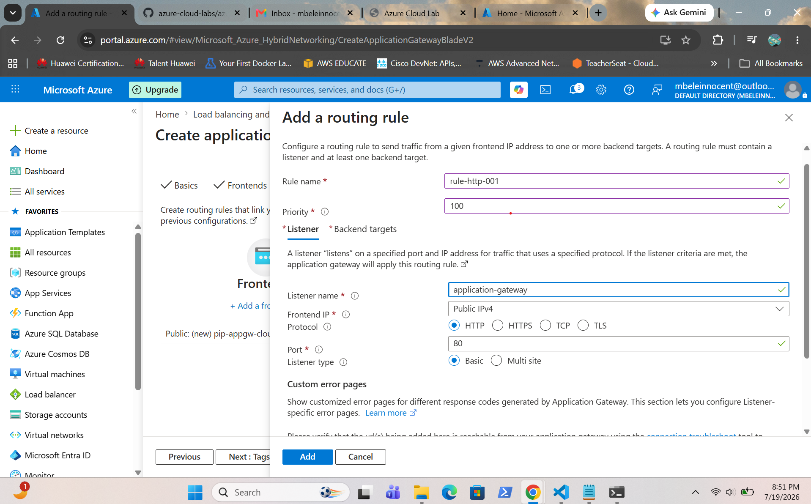

---

### Configure Backend Settings

Shows the backend HTTP settings associated with the routing rule.

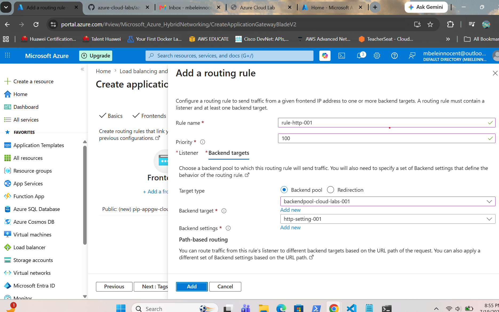

---

### Configure Routing Rule

Shows the completed routing rule connecting the listener and backend pool.

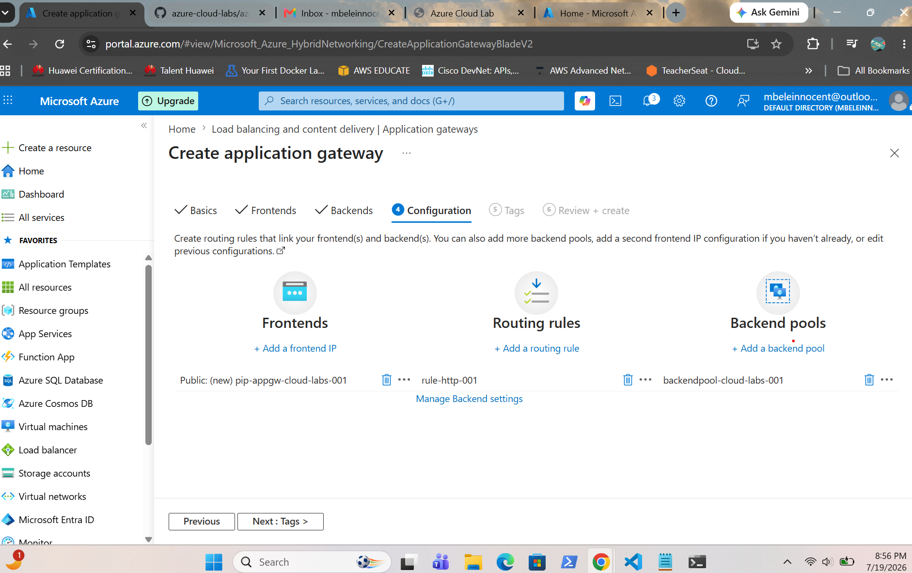

---

### Validation Passed

Shows Azure successfully validating the deployment configuration before deployment.

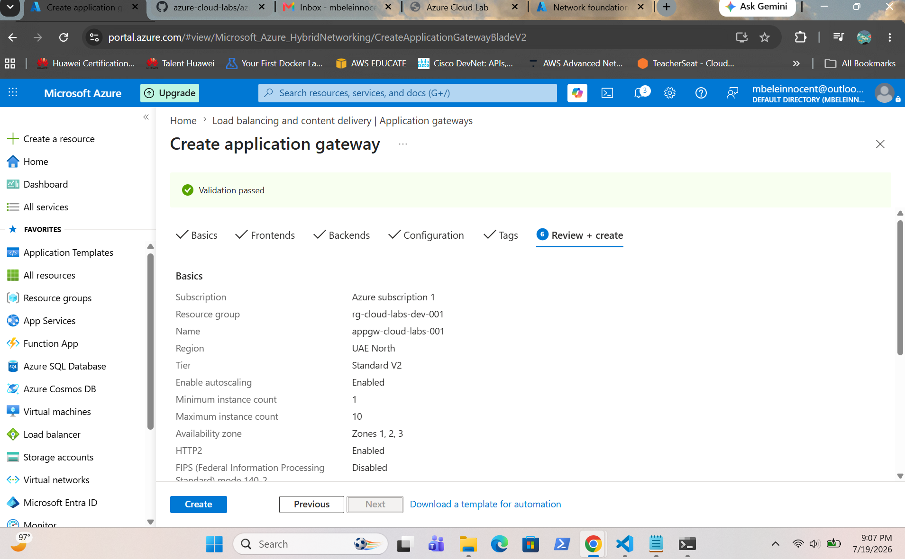

---

### Deployment Success

Shows the successful deployment of the Azure Application Gateway.

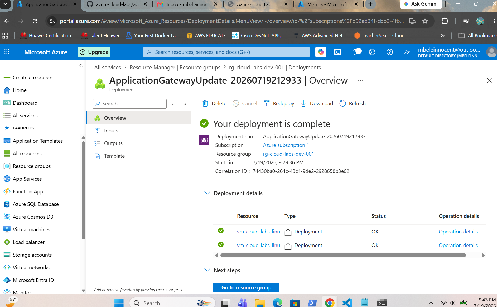

---

### Backend Pool Associated

Shows the Application Gateway successfully routing traffic to the backend pool containing both Linux virtual machines.

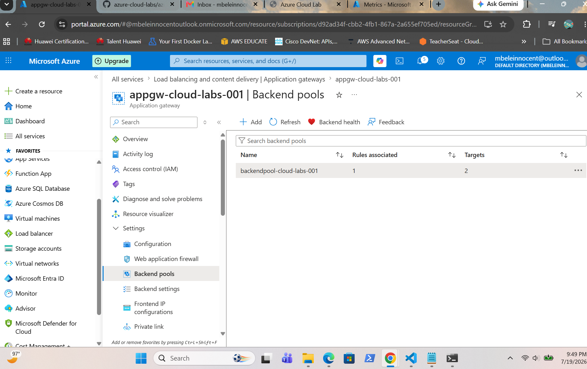

---

## Demonstration Video

The video demonstrates end-to-end Layer 7 load balancing through the Azure Application Gateway.

📥 **[Open Demo Video](videos/azure-application-gateway-end-to-end-load-balancing.mp4)**

> GitHub opens the file preview page. Click **Download** in the top-right corner to save the video.

---

# Project Outcome

- Successfully deployed an Azure Application Gateway.
- Configured a dedicated Application Gateway subnet.
- Configured a frontend public IP.
- Added two Linux virtual machines to the backend pool.
- Configured backend settings and HTTP listener.
- Created routing rules for incoming HTTP traffic.
- Successfully validated and deployed the Application Gateway.
- Verified end-to-end Layer 7 load balancing through live traffic distribution between both backend servers.