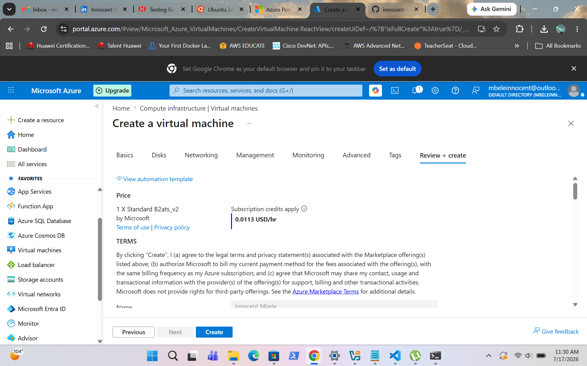
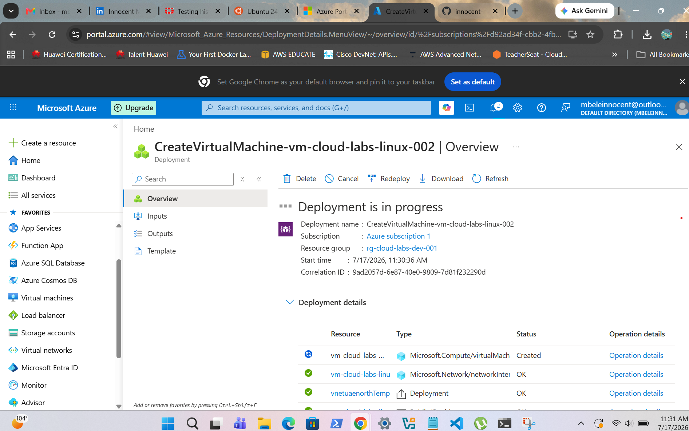
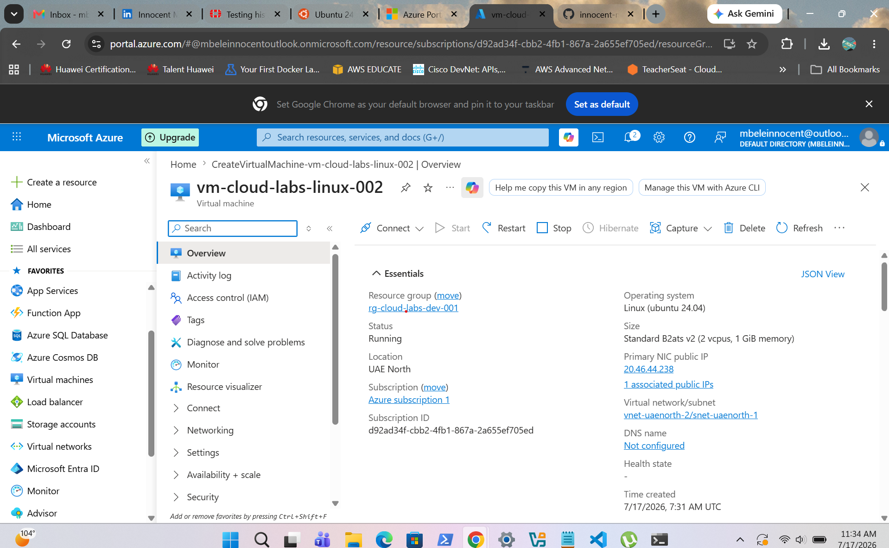
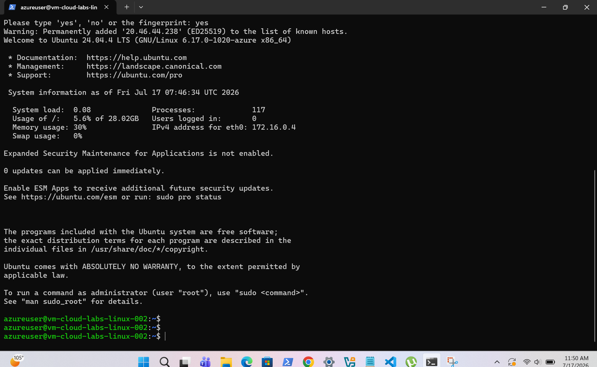
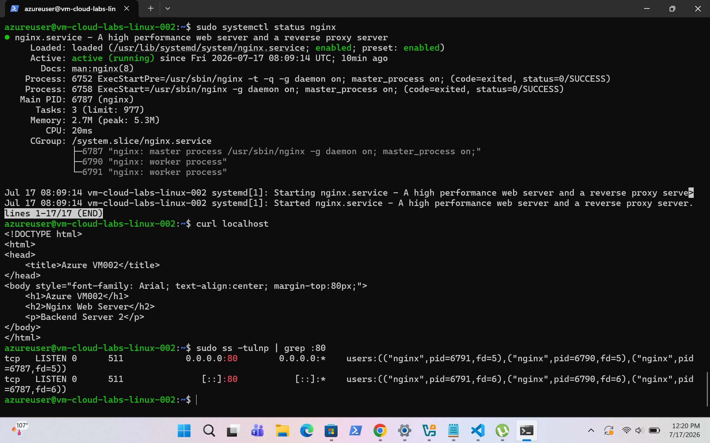

# Project 03 - Azure Linux VM 2 Deployment

## Overview

This project demonstrates the deployment of a second Ubuntu Linux virtual machine in Microsoft Azure. The virtual machine was configured with SSH key authentication, secured with a Network Security Group, and prepared to host web applications using Nginx.

---

## Verification

- Virtual machine deployed successfully.
- SSH remote access verified.
- Nginx installed and running.
- Web server accessible through the public IP address.

---

## Screenshots

### Review and Create

---

### Deployment Successful

---

### Virtual Machine Overview

---

### SSH Remote Access

---

### Nginx Web Server

