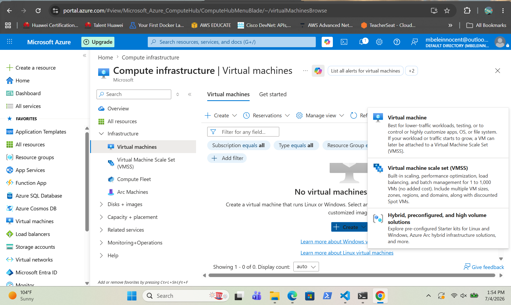
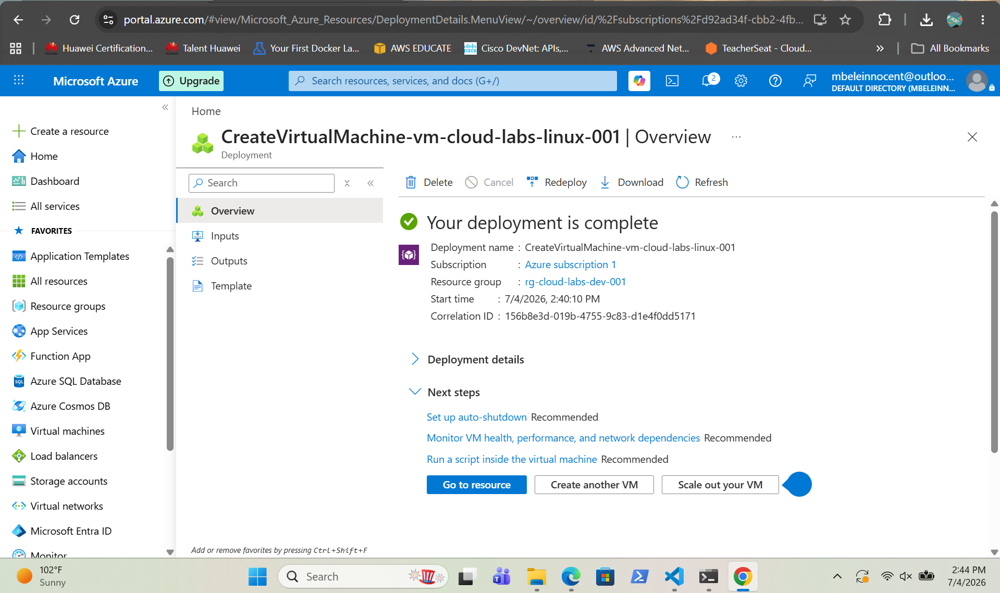
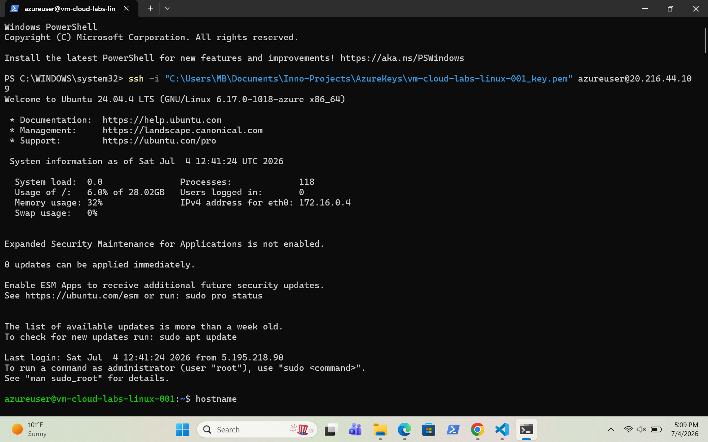
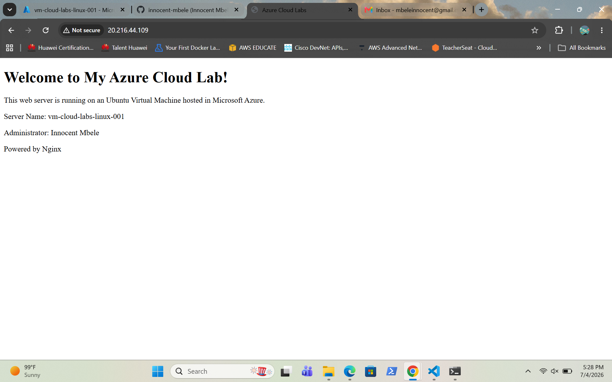

# Azure Linux VM Deployment

Deployed an Ubuntu Linux Virtual Machine in Microsoft Azure and connected to it using SSH. Installed Nginx and hosted a custom web page.

## Deployment

| Resource | Name |
|----------|------|
| Virtual Machine | vm-cloud-labs-linux-001 |
| Operating System | Ubuntu Server 24.04 LTS |
| Authentication | SSH Key |
| Web Server | Nginx |

## Screenshots

### 1. Creating the virtual machine

### 2. VM deployment complete

### 3. SSH connection to the VM

### 4. Nginx running on the VM

### 5. Custom web page
