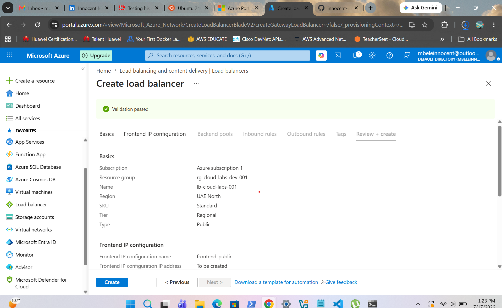
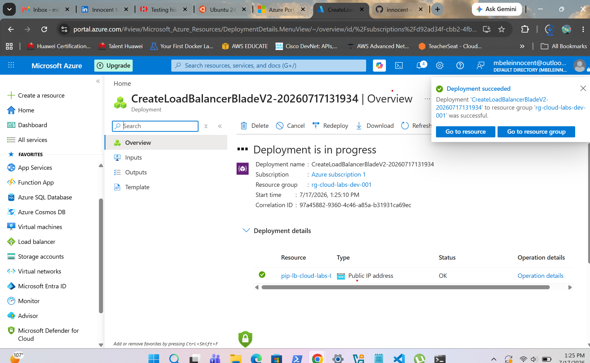
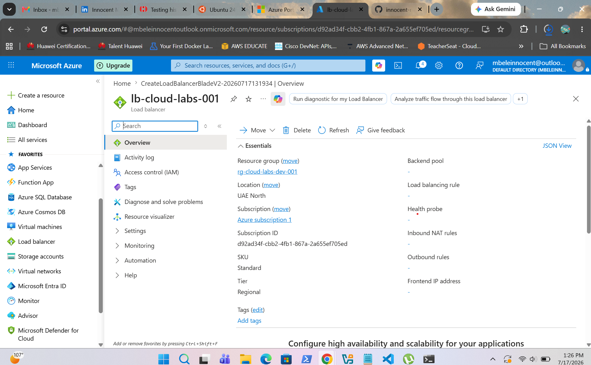
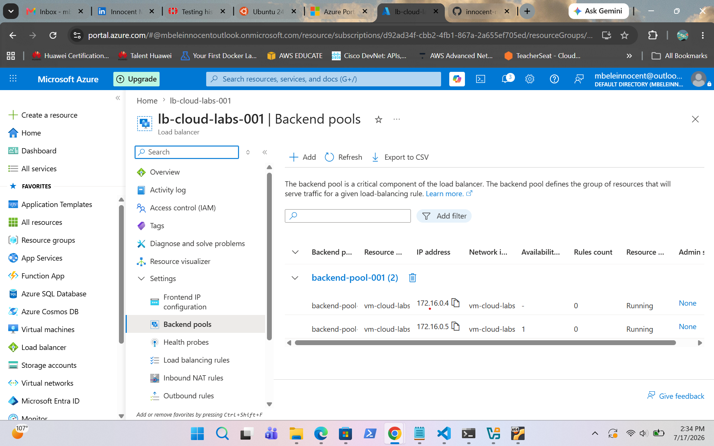
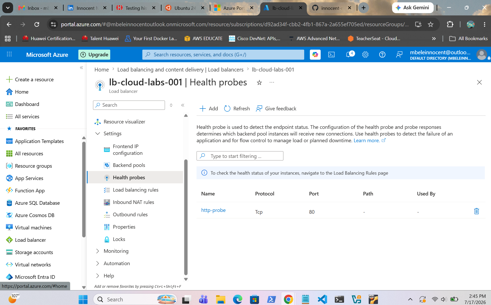
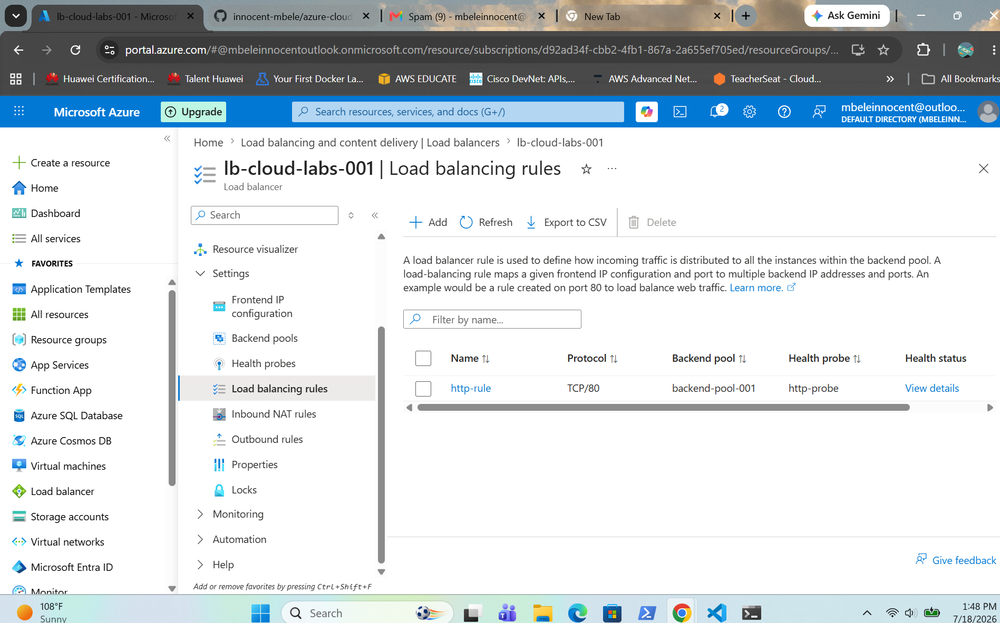
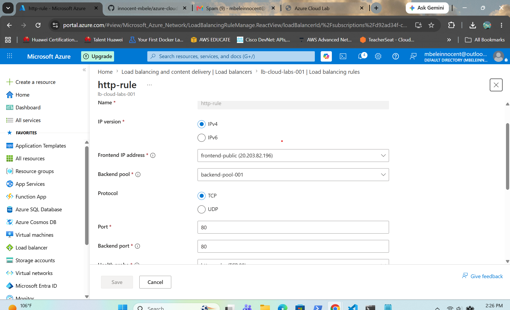
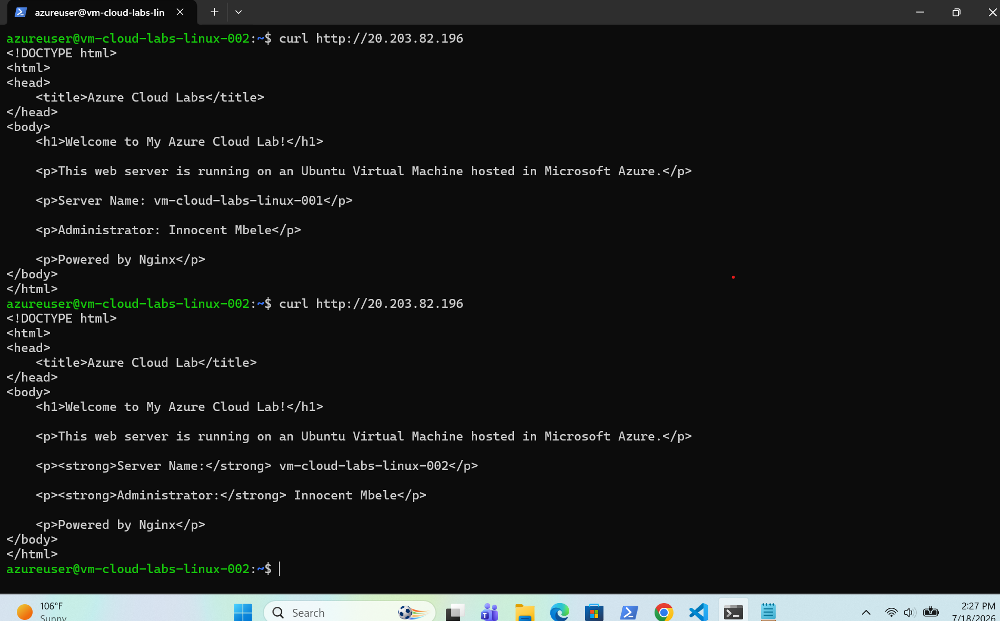
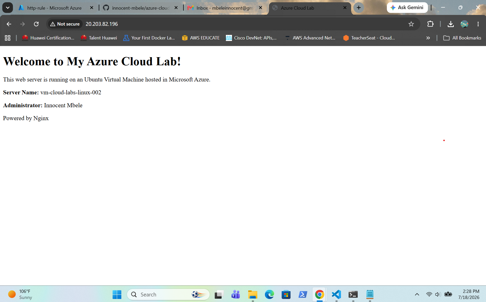
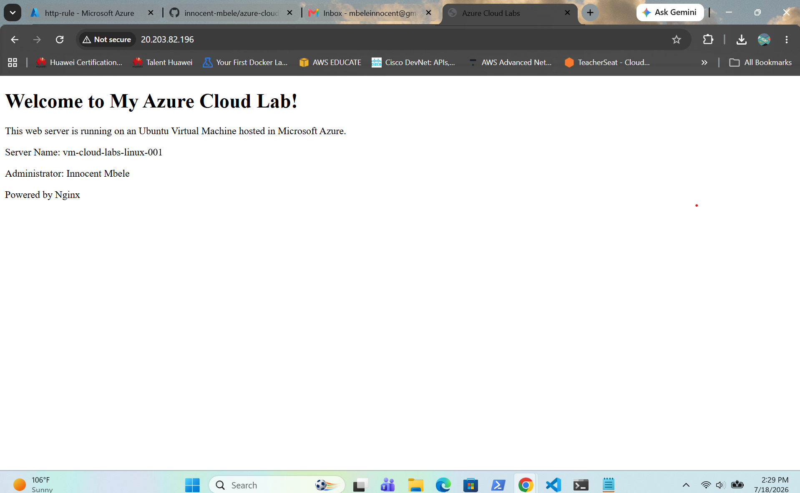

# Project 04 - Azure Standard Load Balancer

## Overview

This project demonstrates the deployment and configuration of an Azure Standard Load Balancer to distribute HTTP traffic across two Ubuntu Linux virtual machines running Nginx. A backend pool, health probe and load balancing rule were configured to provide high availability and automatic traffic distribution.

---

## Configuration Completed

- Deployed Azure Standard Load Balancer
- Configured a Frontend Public IP
- Created a Backend Pool
- Added two Ubuntu Linux virtual machines
- Configured an HTTP Health Probe
- Created an HTTP Load Balancing Rule
- Installed and configured Nginx on both virtual machines
- Verified backend health
- Confirmed traffic distribution across both servers

---

## Architecture

```text
                Internet
                    │
                    ▼
      Azure Standard Load Balancer
                    │
        ┌───────────┴───────────┐
        │                       │
        ▼                       ▼
vm-cloud-labs-linux-001   vm-cloud-labs-linux-002
       Nginx                    Nginx
```

---

## Verification

- Both backend virtual machines reported healthy.
- Health probe reached 100% healthy status.
- HTTP requests were successfully distributed across both virtual machines.
- Load balancing was verified using a web browser and PowerShell `curl` commands.

---

## Screenshots

### Review and Create



---

### Deployment Successful



---

### Load Balancer Overview



---

### Backend Pool



---

### Health Probe



---

### Load Balancing Rule



---

### Health Probe - 100% Healthy


---

### Load Balancing Rule Verification



---

### PowerShell Verification



---

### Browser Verification - VM002



---

### Browser Verification - VM001

