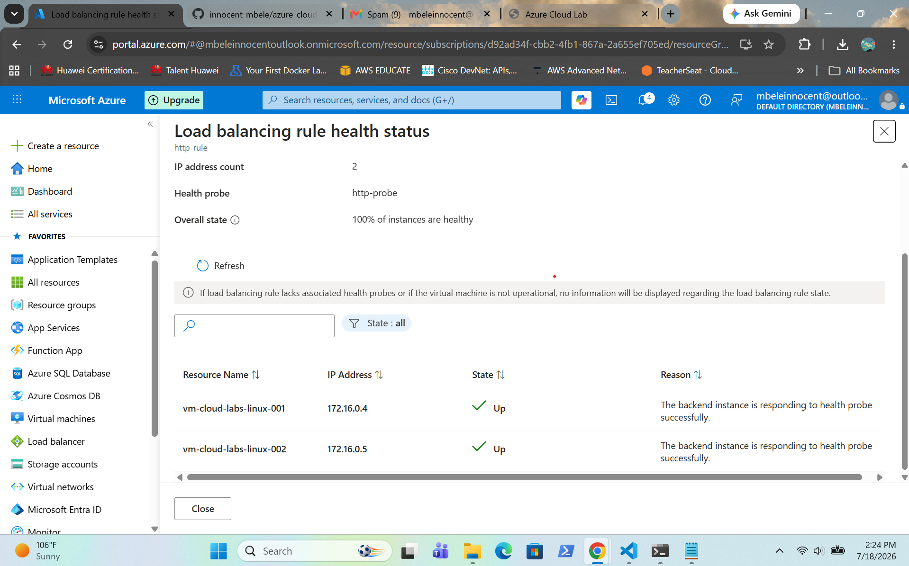

# Azure Standard Load Balancer

## Overview

This project demonstrates the deployment and configuration of an Azure Standard Load Balancer to distribute HTTP traffic across two Ubuntu Linux virtual machines running Nginx. A frontend public IP, backend pool, HTTP health probe and load balancing rule were configured to provide high availability and automatic traffic distribution. Nginx was installed on both virtual machines, and traffic distribution was verified using a web browser and PowerShell `curl` commands.

---

## Architecture

```text
                Internet
                    │
                    ▼
      Azure Standard Load Balancer
                    │
        ┌───────────┴───────────┐
        │                       │
        ▼                       ▼
vm-cloud-labs-linux-001   vm-cloud-labs-linux-002
       Nginx                    Nginx
```

---

## Screenshots

### Review and Create

Shows the Azure configuration before deploying the Standard Load Balancer.


---

### Deployment Successful

Shows the successful deployment of the Azure Standard Load Balancer.


---

### Load Balancer Overview

Shows the deployed load balancer and its frontend configuration.


---

### Backend Pool

Shows both Ubuntu Linux virtual machines added to the backend pool.


---

### Health Probe

Shows the HTTP health probe configured to monitor the availability of the backend virtual machines.


---

### Load Balancing Rule

Shows the HTTP load balancing rule linking the frontend IP, backend pool and health probe.


---

### Health Probe Status

Shows both backend virtual machines reporting a healthy status.



---

### Load Balancing Rule Verification

Shows the completed load balancing rule configuration.


---

### PowerShell Verification

Shows HTTP requests distributed between both backend virtual machines using PowerShell `curl`.


---

### Browser Verification – VM002

Shows the load balancer routing traffic to **vm-cloud-labs-linux-002**.


---

### Browser Verification – VM001

Shows the load balancer routing traffic to **vm-cloud-labs-linux-001**.

