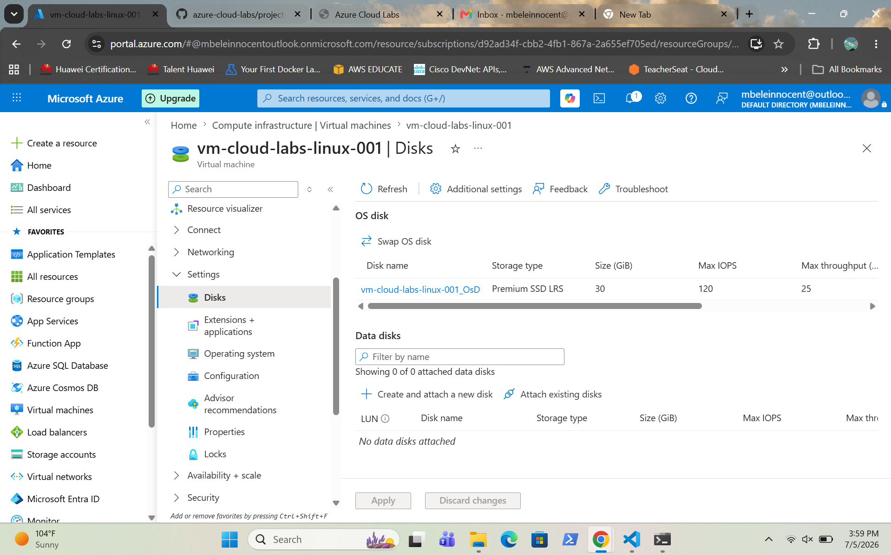
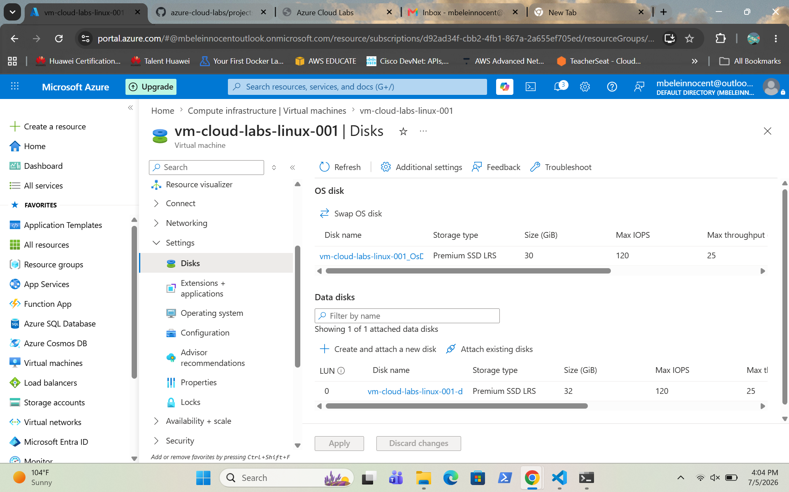
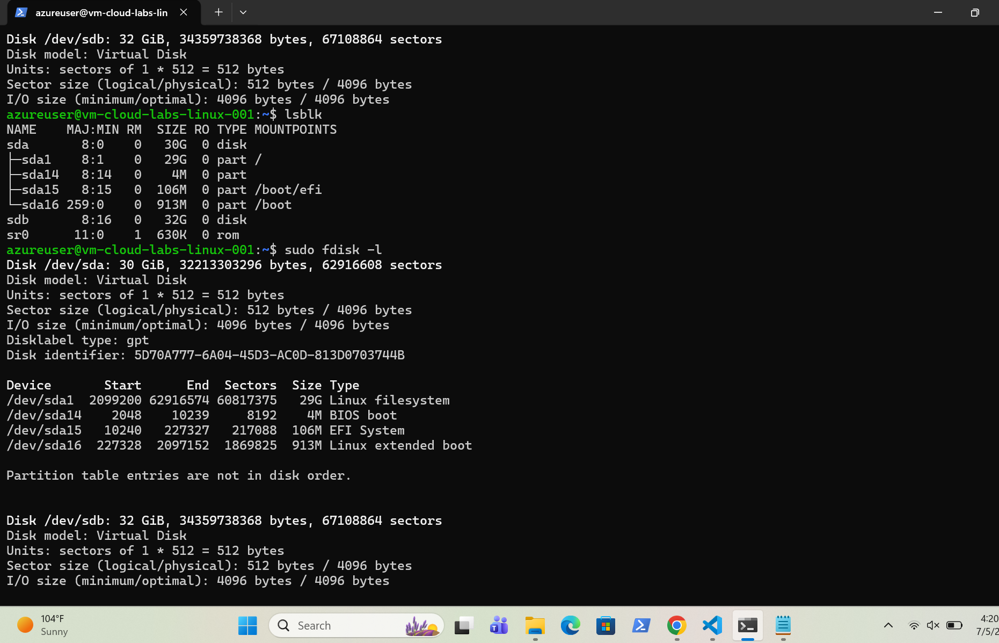
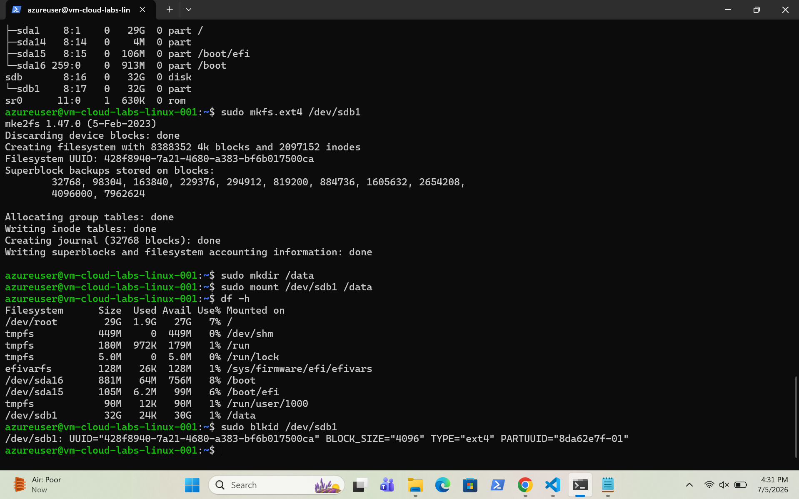

# Azure Managed Disks

## Overview

This project demonstrates the creation and attachment of an Azure Managed Disk to an existing Ubuntu Linux virtual machine. The disk was partitioned, formatted and mounted to provide additional persistent storage for the server.

---

## Screenshots

### Disks Overview in the VM

Shows the virtual machine disk configuration before attaching an additional managed disk.

---

### Data Disk Attached

Shows the managed data disk successfully attached to the virtual machine.

---

### SSH Access

Shows a successful SSH connection to the virtual machine for disk configuration.

---

### Disk Partition and Mount

Shows the managed disk partitioned, formatted and mounted successfully.

