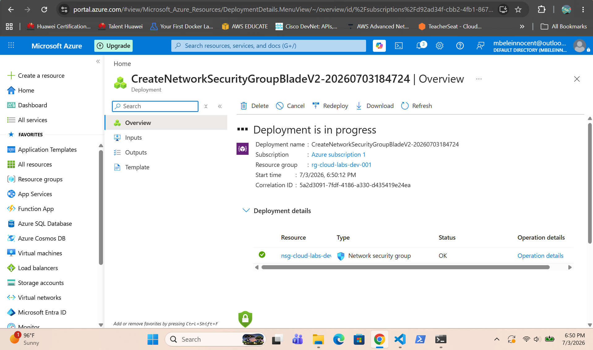
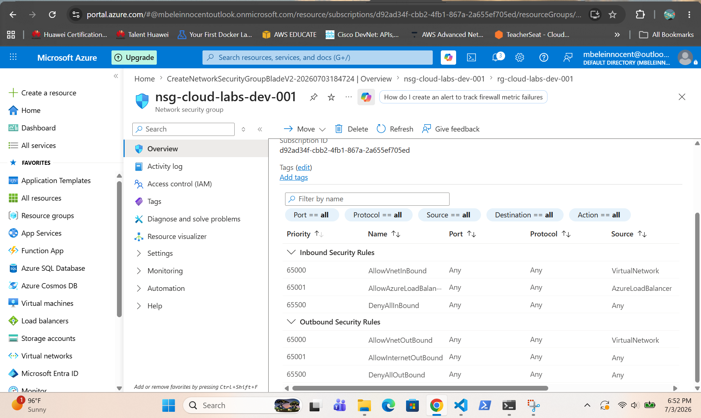
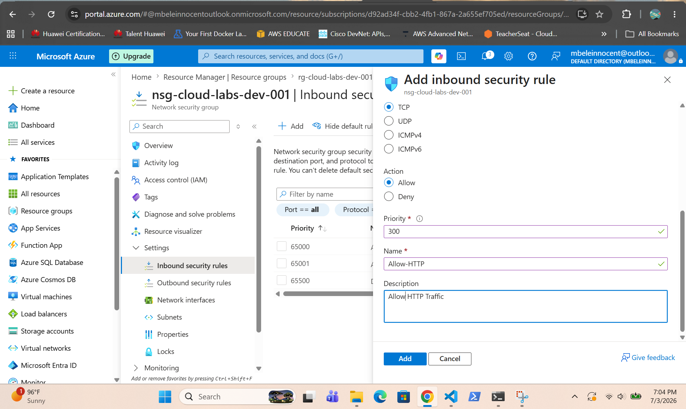
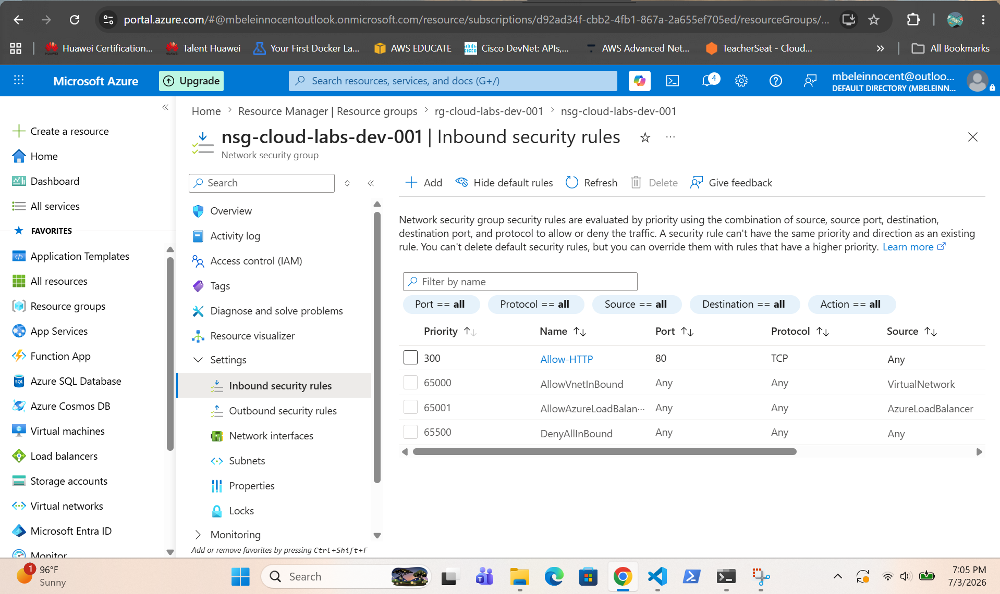
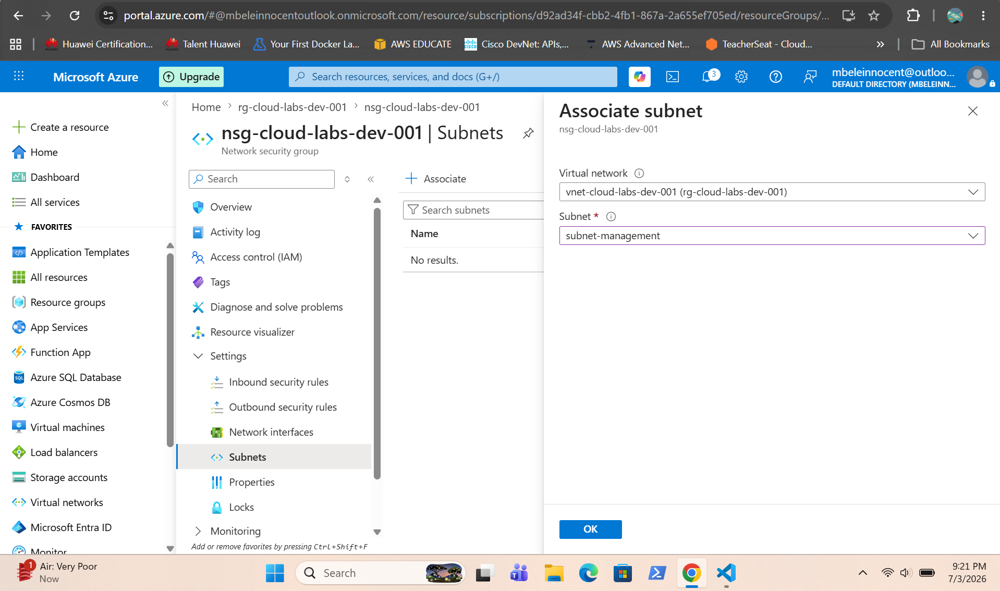
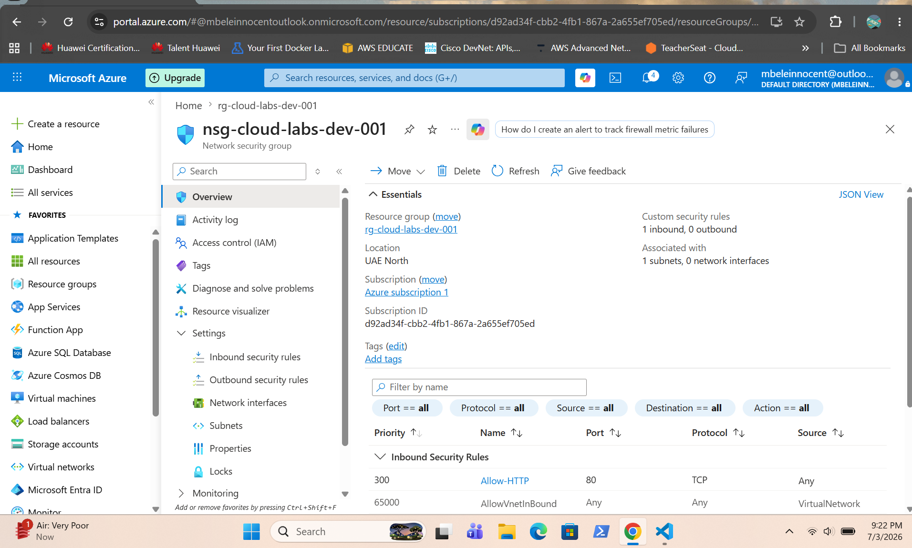

# Azure Network Security Group

## Overview

This project demonstrates the creation and configuration of an Azure Network Security Group (NSG) to control inbound network traffic. Security rules were configured to allow SSH (port 22) for remote administration and HTTP (port 80) for web traffic. The NSG was then associated with the virtual network subnet to protect the deployed resources.

---

## Screenshots

### NSG Created

Shows the successful deployment of the Azure Network Security Group.

---

### NSG Overview

Shows the Network Security Group properties and configuration after deployment.

---

### Default Security Rules

Shows the default inbound and outbound security rules created with the NSG.

---

### Creating HTTP Rule

Shows the configuration of the inbound HTTP rule to allow web traffic on port 80.

---

### HTTP Rule Added

Shows the completed HTTP inbound rule successfully added to the Network Security Group.

---

### Associating NSG with Subnet

Shows the Network Security Group being associated with the virtual network subnet.

---

### NSG Association Overview

Shows the Network Security Group successfully associated with the subnet.

---

### Subnet Protected by NSG

Shows the subnet protected by the associated Network Security Group.

