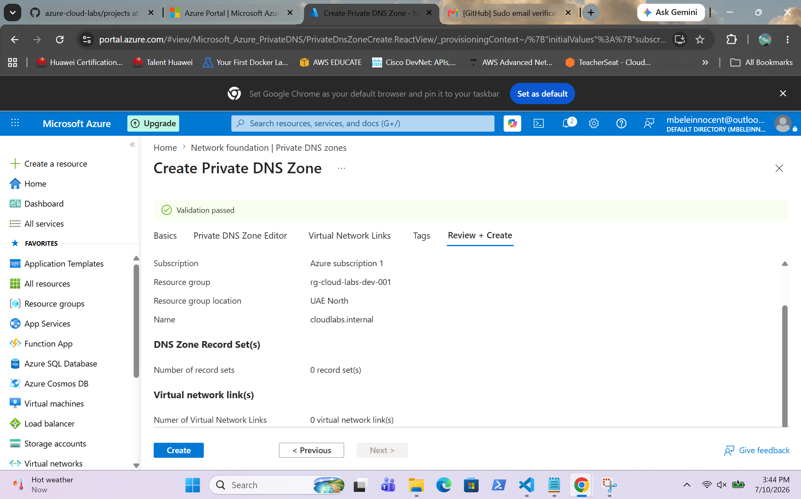
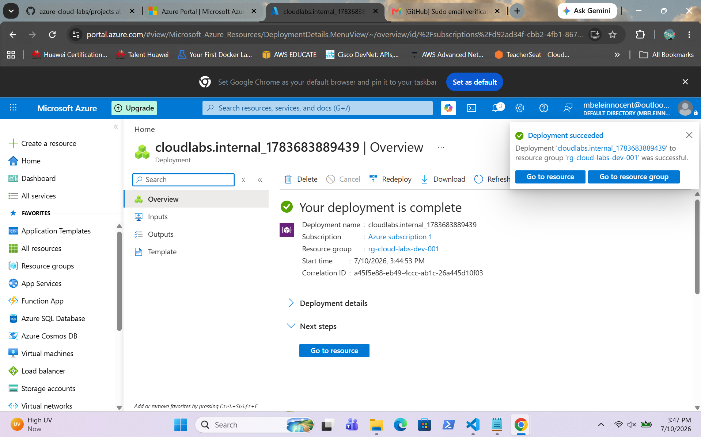
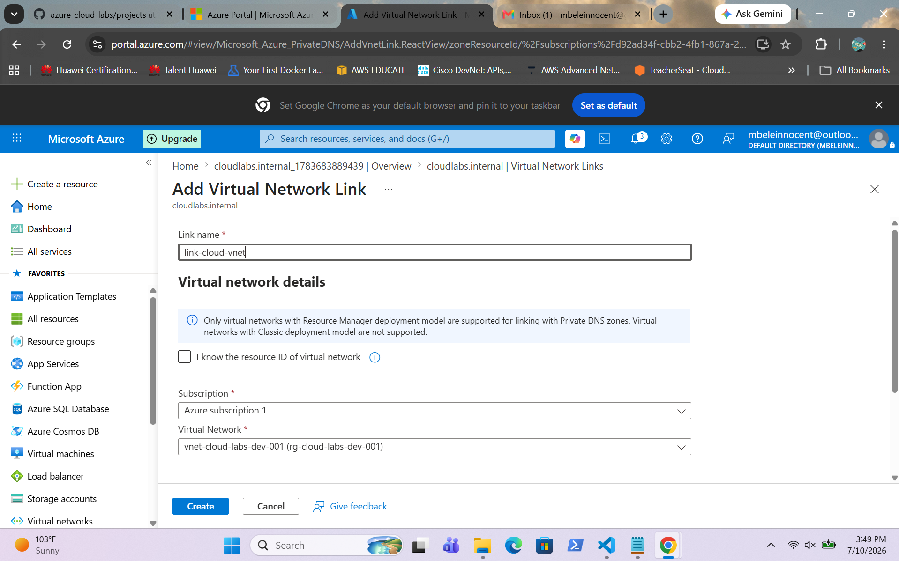
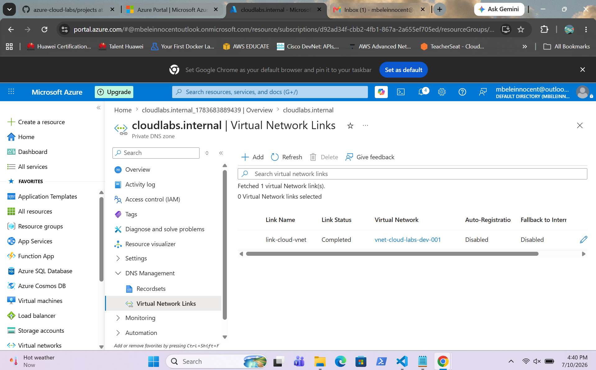

# Azure Private DNS

## Overview

This project demonstrates the creation of an Azure Private DNS Zone and its integration with an Azure Virtual Network. The DNS zone was linked to the virtual network to enable private name resolution for Azure resources without exposing DNS records to the public internet.

---

## Screenshots

### Create Private DNS Zone

Shows the configuration before creating the Azure Private DNS Zone.

---

### Private DNS Zone Created

Shows the successful deployment of the Azure Private DNS Zone.

---

### Link Virtual Network

Shows the configuration for linking the Azure Virtual Network to the Private DNS Zone.

---

### Virtual Network Linked

Shows the Azure Virtual Network successfully linked to the Private DNS Zone, enabling private DNS name resolution.

