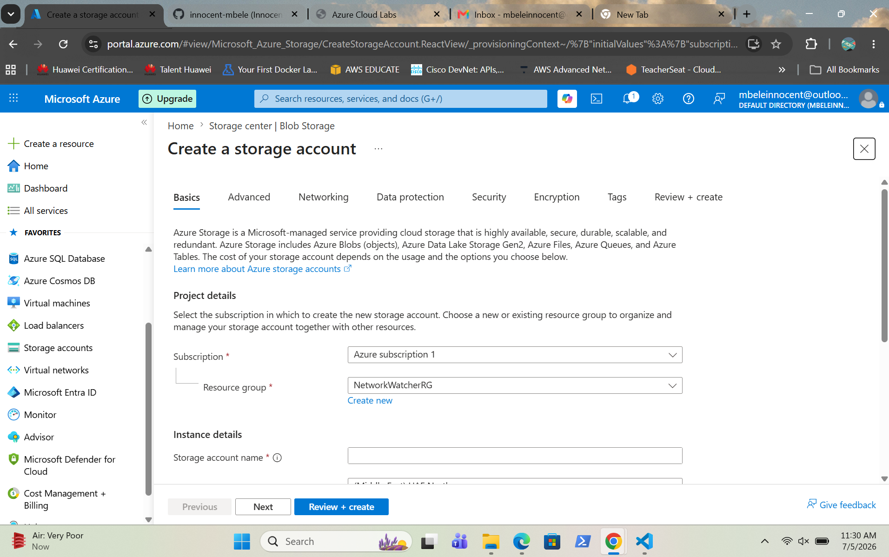
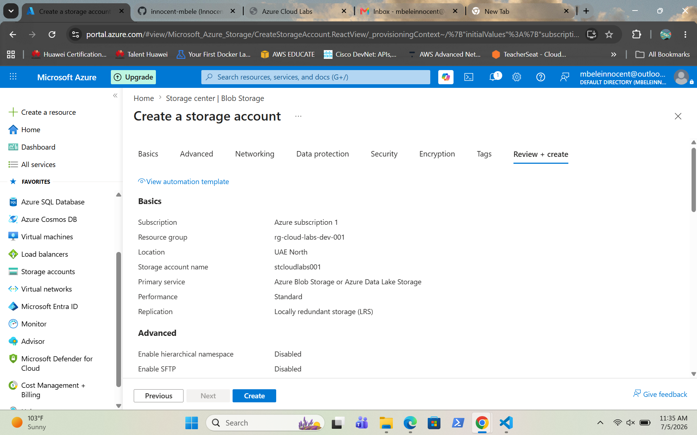
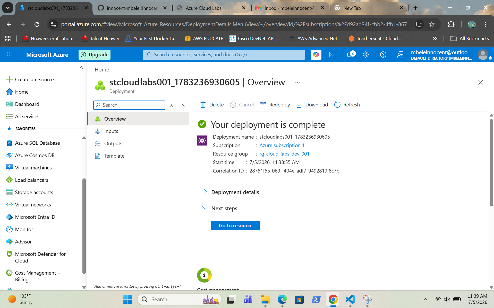
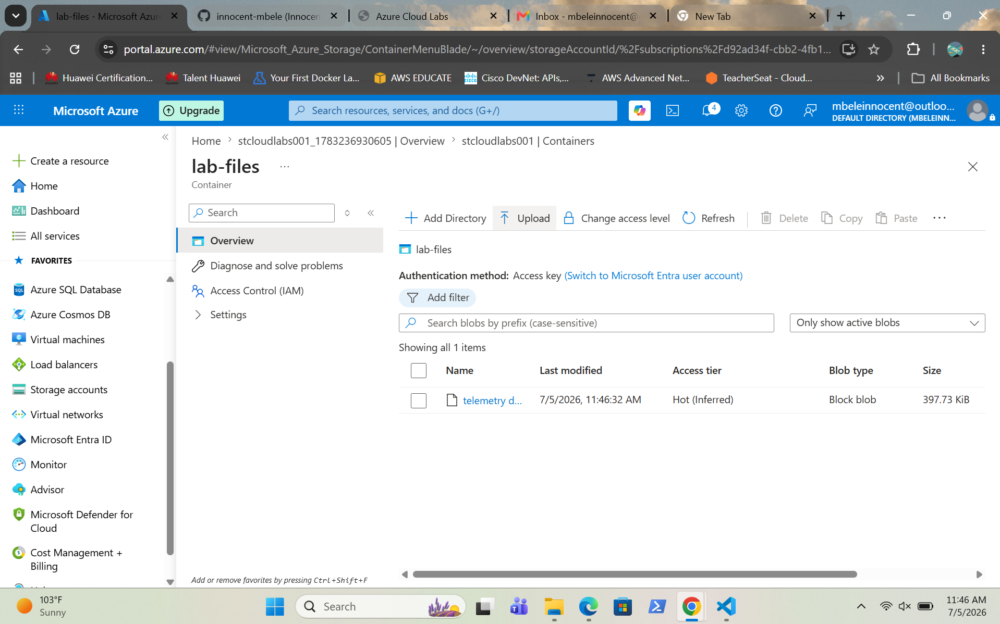

# Azure Storage Account

## Overview

This project demonstrates the creation of an Azure Storage Account and the use of Azure Blob Storage to store files. A storage account was deployed, a blob container was created and a sample file was uploaded to verify successful storage configuration.

---

## Screenshots

### Create Storage Account

Shows the configuration before creating the Azure Storage Account.

---

### Review and Create

Shows the Azure deployment summary before creating the Storage Account.

---

### Storage Deployment Successful

Shows the successful deployment of the Azure Storage Account.

---

### Storage Account Overview

Shows the Storage Account properties and configuration after deployment.

---

### Blob Container Overview

Shows the Blob Storage container created within the Storage Account.

