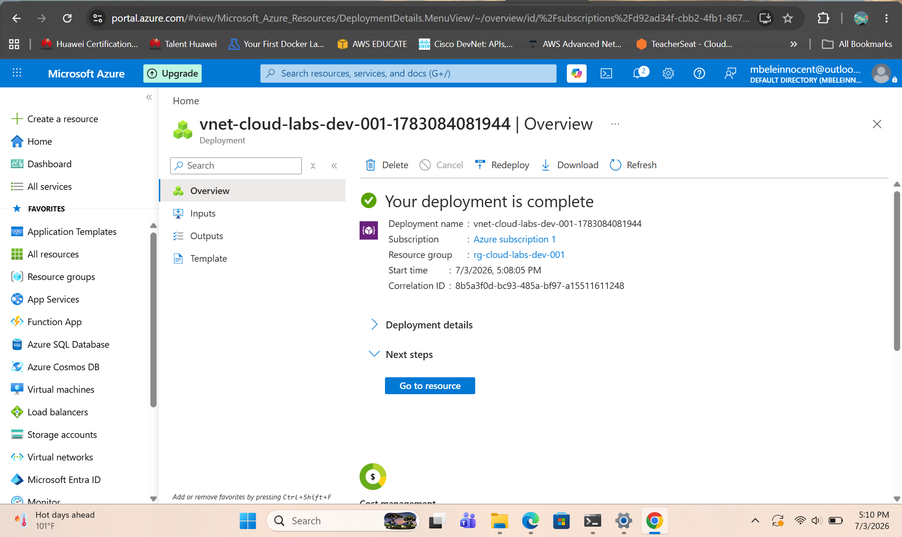
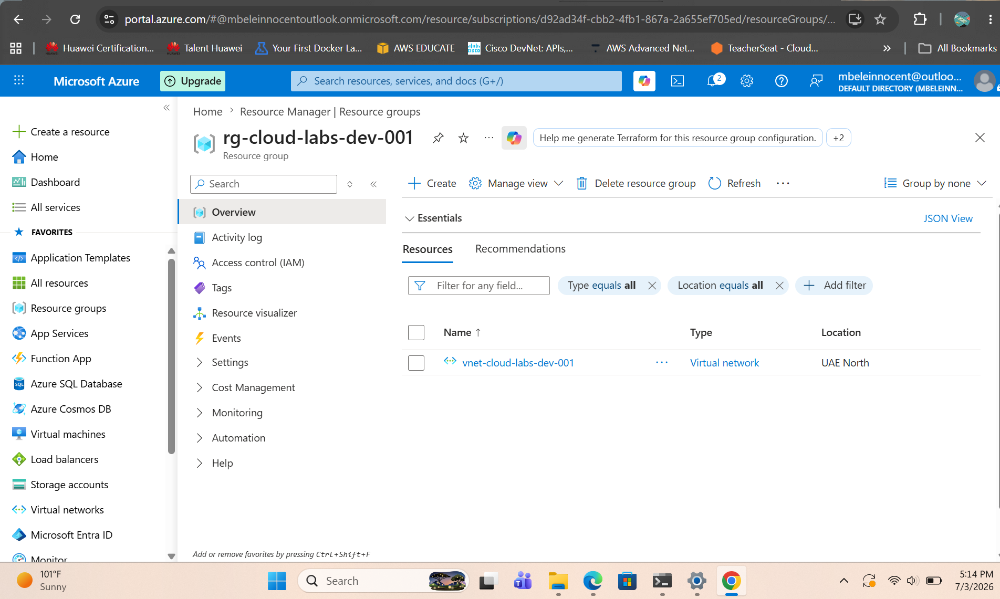
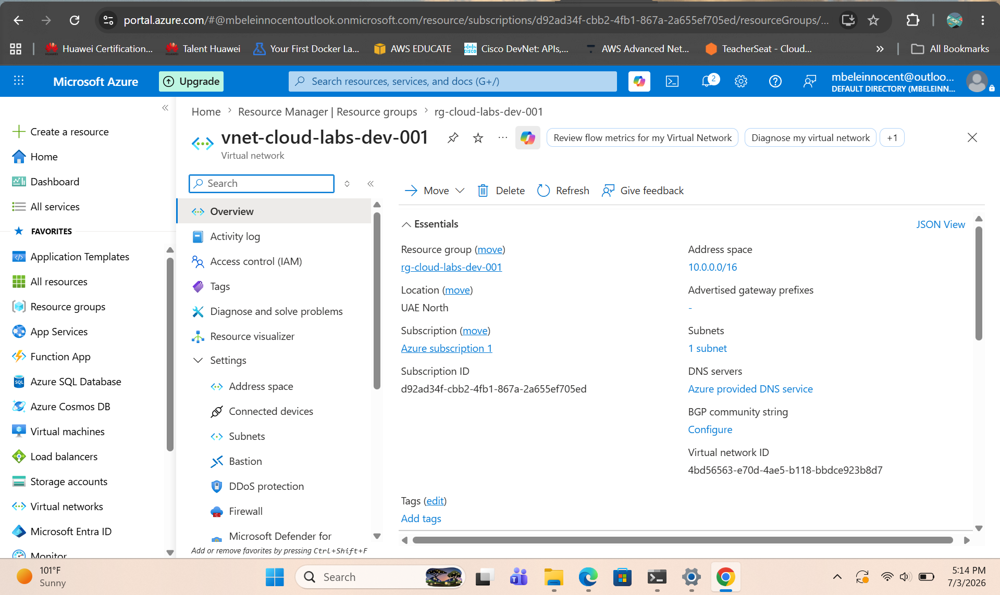
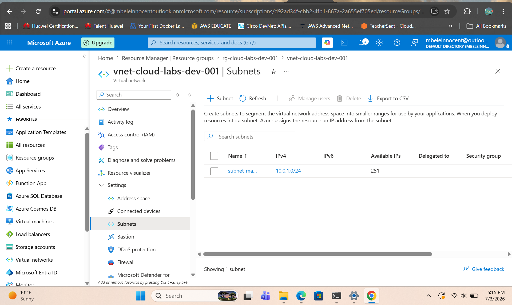

# Azure Virtual Network Deployment

## Overview

This project demonstrates the deployment of an Azure Virtual Network (VNet) with a dedicated Resource Group and management subnet. The virtual network was configured with a custom address space and subnet to provide the foundation for deploying and managing Azure resources.

---

## Screenshots

### Deployment Successful

Shows the successful deployment of the Azure Virtual Network.

---

### Resource Group

Shows the Resource Group containing the deployed Azure networking resources.

---

### Virtual Network Overview

Shows the Virtual Network configuration, including the address space and associated resources.

---

### Management Subnet

Shows the management subnet configured within the Azure Virtual Network.

