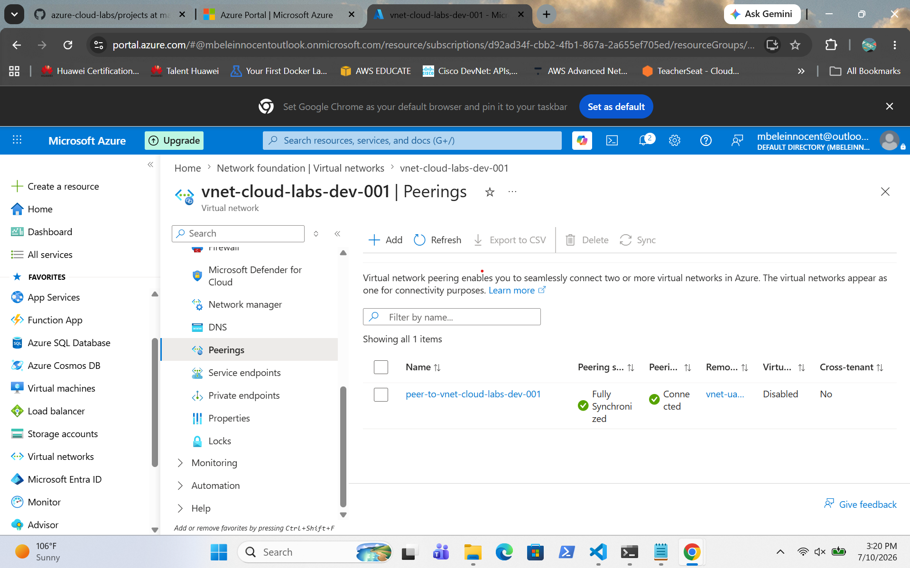
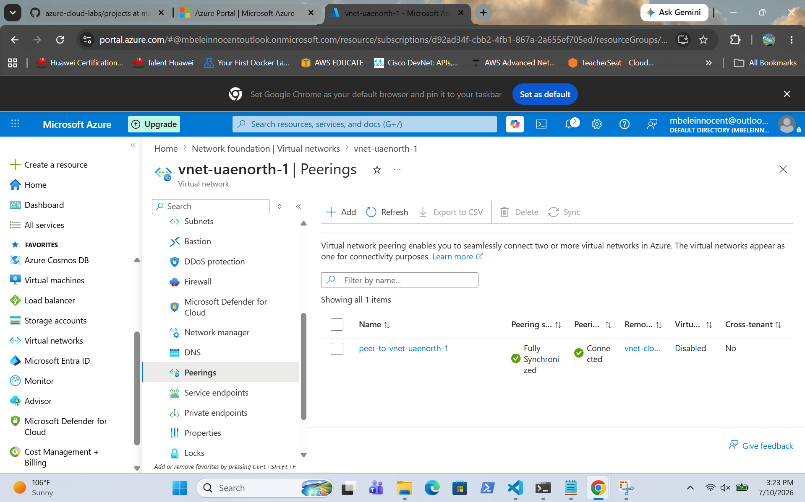

# Azure Virtual Network Peering

## Overview

This project demonstrates the configuration of Azure Virtual Network (VNet) Peering to enable private communication between two virtual networks. Peering was successfully established, allowing resources in both VNets to communicate over the Microsoft backbone network without requiring a VPN or public internet connectivity.

---

## Screenshots

### VNet Cloud Connected

Shows the first virtual network successfully configured with VNet peering.

---

### VNet UAE North Connected

Shows the second virtual network successfully connected through Azure VNet Peering.

