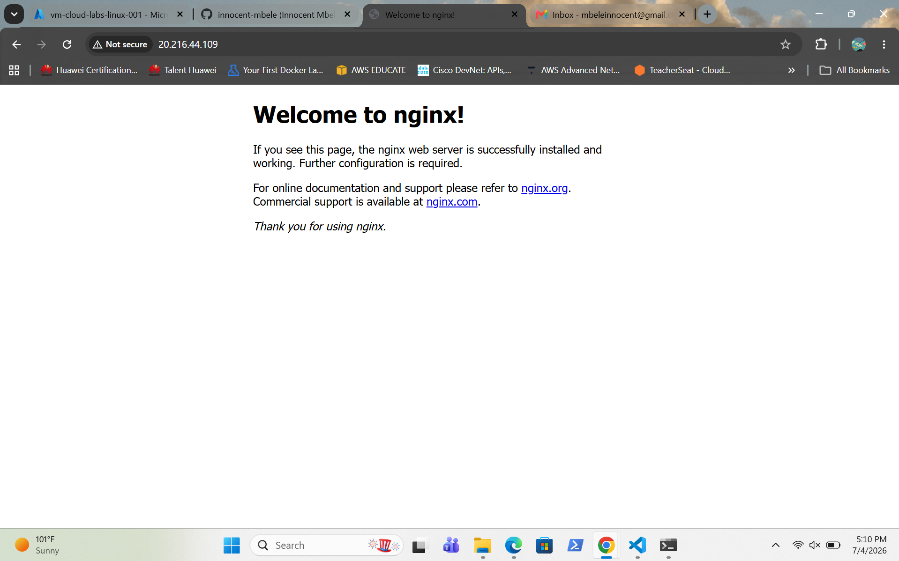

# Azure Linux VM Deployment

Deploy an Ubuntu Linux virtual machine in Microsoft Azure, connect securely using SSH, install Nginx, and host a custom web page.

## Skills

- Microsoft Azure
- Azure Virtual Machine (VM)
- Ubuntu Linux
- SSH
- Azure Network Security Group (NSG)
- Nginx

## Screenshots

### 1. Creating the Virtual Machine

### 2. Azure VM Deployment Complete

### 3. SSH Connection to the Azure VM

### 4. Testing Nginx After Installation

### 5. Custom Web Page Created
