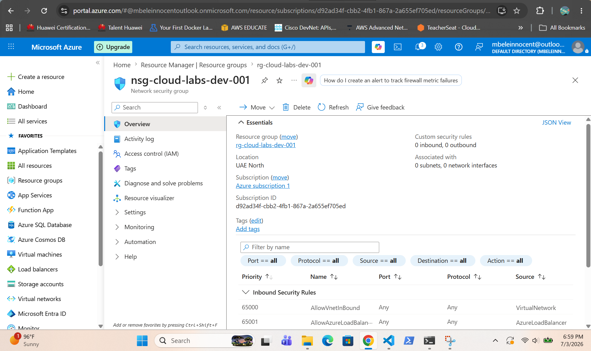
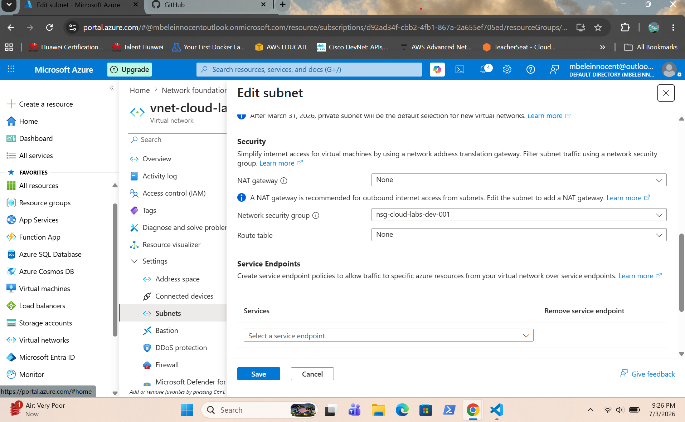

# Azure Network Security Group (NSG)

Configure an NSG and associate it with a subnet.

## Quick Notes

- NSGs filter inbound and outbound traffic.
- Lower priority number = higher priority.
- First matching rule is applied.
- Can be attached to a subnet or NIC.
- Default rules remain unless overridden.

## Screenshots

### NSG Created

### NSG Overview

### Default Rules

### HTTP Rule

### NSG Association
