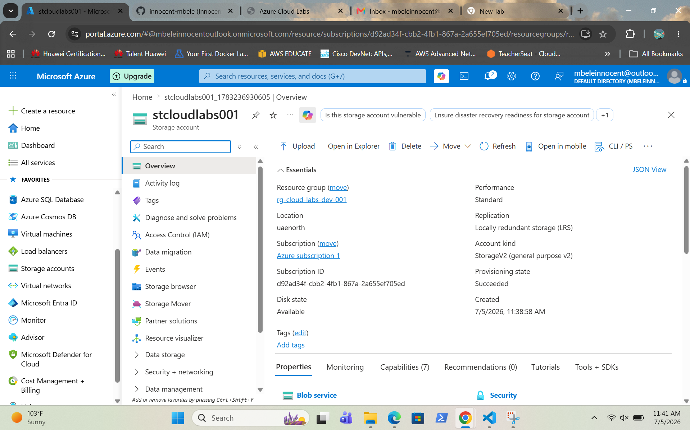

# Azure Storage Account

Created an Azure Storage Account and uploaded a file to Azure Blob Storage.

## Screenshots

### 1. Create Storage Account

### 2. Review and Create

### 3. Storage Deployment Success

### 4. Storage Account Overview

### 5. Storage Container Overview
